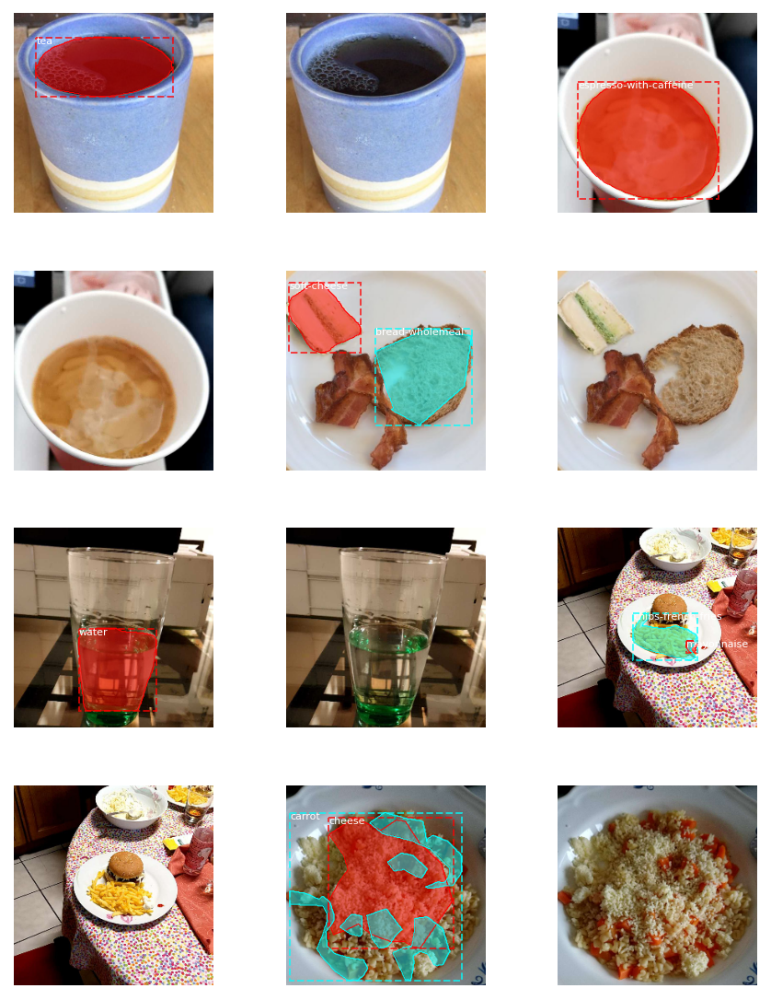

# Food Recognition Challenge
🍕🍎 Food Detection using Mask R-CNN

## Requirements
- Python3
- Tensorflow 1.15.0
- Keras 2.8.0

## Food Dataset

https://www.kaggle.com/rohitmidha23/food-recognition-challenge

This is a novel dataset of food images collected through the MyFoodRepo app where numerous volunteer Swiss users provide images of their daily food intake in the context of a digital cohort called Food & You. This growing data set has been annotated - or automatic annotations have been verified - with respect to segmentation, classification (mapping the individual food items onto an ontology of Swiss Food items), and weight / volume estimation.

### About Dataset
- train data: 7,949 images, 61 classes
- validation data: 418 images, 61 classes

### The purpose of the challenge
Detect the food in the image using Mask RCNN

## Mask R-CNN

Mask RCNN is a deep neural network aimed to solve instance segmentation problem in machine learning or computer vision. In other words, it can separate different objects in a image or a video. You give it a image, it gives you the object bounding boxes, classes and masks.

If you want to know about Mask RCNN, please check this link. https://github.com/namyouth/Mask_R-CNN/blob/master/Mask_R-CNN_Explained.ipynb

### Pre-trained weights
To train Mask R-CNN, we used pre-trained weight of Matterport Mask R-CNN.
https://github.com/matterport/Mask_RCNN/releases/download/v2.0/mask_rcnn_coco.h5

## Results
### loss DataFrame

### Visualization

## Reference
- https://cybercm.tech/blog/2019/12/18/running-distributed-tensorflow-training-with-amazon-sagemaker/
- https://www.kaggle.com/shraddhaamohan/mask-rcnn-food-starter
